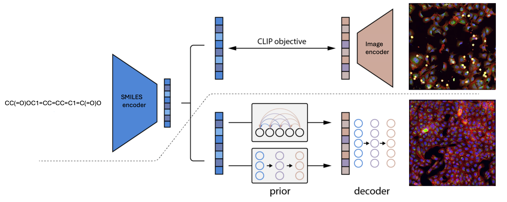

# Model Architecture


## Instructions
CLIP training script
```bash
python scripts/train_clip.py --experiment_ID

### Server
- DGX

### Docker Image
- `ai_project:latest`

### Installation
First, install the necessary dependencies by running the following command in the root directory:
```bash
python3 install -e .
